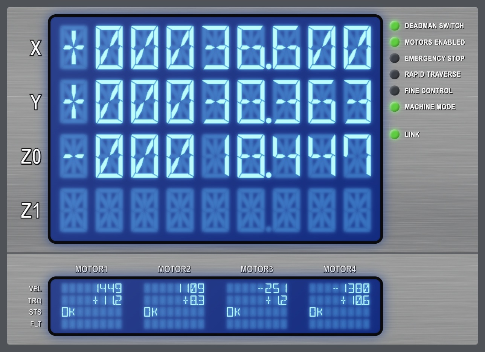

# Remote App Monitor

Live dashboards for values streamed from microcontrollers and other programs.
Values arrive over a serial port or ZeroMQ, and are shown in the browser, in
the terminal, or both.



- **Web dashboards in plain HTML.** Mark up any element with
  `data-bind="<id>"` and it stays live. No JavaScript to write. A generic page
  is served if you don't have one.
- **Keeps up with fast devices.** Serial input is read on a background thread
  and drained completely on every read, so the display never falls behind
  and a stalled device can't freeze the dashboard.
- **Survives unplugging.** The serial source waits for the device to appear
  and reconnects after a disconnect. Browsers reconnect by themselves, and
  dim stale values while the link is down.
- **Only redraws what changed.** Outputs wake up when data changes (at most
  `fps` times a second), and the browser is sent only the values that changed.
- **Pluggable.** Sources, wire formats (decoders), elements and outputs are
  small interfaces you can implement yourself.

## Install

Requires Python 3.11+. The core has no dependencies; pick the extras you need:

```bash
pip install "remote-app-monitor[web,serial]"   # or [zmq], or [all]
```

## Quick start

```python
import asyncio

from app_monitor import (
    CsvDecoder,
    IndicatorLamp,
    Monitor,
    RangeBar,
    SerialSource,
    TextElement,
    TextFormat,
    WebDashboard,
)

monitor = Monitor()
monitor.add(
    TextElement(
        "temperature", label="Temperature", units="°C", format=TextFormat(precision=1)
    ),
    IndicatorLamp("pump", label="Pump"),
)
# Groups prefix ids: these become "X.velocity" and "X.torque".
monitor.add_group(
    "X",
    [
        RangeBar("velocity", min_value=-10, max_value=10, units="mm/s"),
        RangeBar("torque", min_value=-5, max_value=5, units="Nm"),
    ],
)

# The device prints one line per sample: "21.5,1,3.2,-0.4"
device = SerialSource(
    "auto",
    115200,
    decoder=CsvDecoder(["temperature", "pump", "X.velocity", "X.torque"]),
)

asyncio.run(monitor.run(sources=[device], outputs=[WebDashboard()]))
```

Open <http://127.0.0.1:8080/> to see the generic dashboard. `WebDashboard`
listens on localhost only by default; pass `host="0.0.0.0"` to allow other
machines on the network. Port 8080 is used because macOS reserves 5000 for
AirPlay.

## Concepts

### Monitor and elements

A `Monitor` holds elements, each with an `id`. Updates are `{id: value}`
mappings; `monitor.update({...})` applies them from code, and sources call it
for you. Unknown ids and values an element can't parse are logged once per id
and skipped.

| Element | Shows | Update with |
| --- | --- | --- |
| `TextElement` | a value, optionally scaled and number-formatted | any value |
| `RangeBar` | a marker on a min to max track | a number |
| `ProgressBar` | a filling bar from 0 to `total` | a number |
| `IndicatorLamp` | on/off | `1`/`0`, `true`/`false`, `on`/`off` |
| `MachineState` | named on/off states packed into one integer | an integer (bit 0 = first state) |
| `Coordinate` | a multi-axis position | a list, or per axis: `"<id>.x"` |
| `Table` | a grid of cells | per cell: `"<id>.<row>.<column>"` |
| `LogMonitor` | the latest messages | a string |

Multi-part elements take updates to a field, addressed as `"<id>.<field>"`
(for example `"machine.estop"` sets one state of a `MachineState`).

`TextFormat(width, precision, force_sign, padding)` formats numbers:
`TextFormat(width=10, precision=3, force_sign=True, padding="0")` turns `27.31`
into `+00027.310`. `Style(fg, bg, bold, dim)` adds colour in the terminal.

### Sources and decoders

| Source | Reads |
| --- | --- |
| `SerialSource(port, baudrate, decoder=...)` | a serial port (`port="auto"` picks the first USB device) |
| `ZmqSource(endpoint, decoder=...)` | a ZeroMQ PUB socket (default decoder: `KeyValueDecoder`) |
| `SimulatedSource(fn, rate)` | `fn(seconds)` called `rate` times a second, for demos and tests |

| Decoder | Wire format |
| --- | --- |
| `CsvDecoder(keys)` | `1.5,-2.0,OK` per line, values in the order of `keys` |
| `KeyValueDecoder()` | `X.velocity 1.5` (or `X.velocity=1.5`) per line |
| `JsonDecoder()` | `{"X": {"velocity": 1.5}}` per line; nesting addresses groups and fields |
| `BinaryFrameDecoder(names, scale=1000)` | the binary frame protocol below |

#### Binary frame protocol

For firmware where text is too slow or too large:

```
0xAA | id | type | value | n | param_1 ... param_n | 0xFF
```

- `type 0x01`: `value` is a little-endian int32, divided by `scale` (1000 by default).
- `type 0x02`: `value` is a NUL-terminated UTF-8 string (up to 255 bytes).
- `id` and the params are single bytes, translated through `names`
  (`{1: "X", 10: "velocity"}`). The update key is the id's name followed by the
  params' names, so id `X` with param `velocity` updates `"X.velocity"`.

Corrupt frames are skipped and decoding resumes at the next `0xAA`.

### Outputs

**`WebDashboard(page=None, static_dir=None, host="127.0.0.1", port=8080, fps=30)`**
serves `page` (or the generic page) and streams values over a WebSocket. Your
page loads `/_app_monitor/app_monitor.js` and marks up elements:

```html
<link rel="stylesheet" href="/_app_monitor/panel.css">

<span data-bind="temperature"></span>                                  <!-- text -->
<div class="led" data-bind="machine.estop" data-mode="state"></div>    <!-- data-state="on"/"off" -->
<div class="bar" data-bind="X.velocity.ratio" data-mode="width"></div> <!-- width: 0-100% -->

<!-- A segment display: data-ghost draws the unlit segments. -->
<div class="lcd">
  <span class="lcd-field" data-ghost="~~~~~~.~~~"><span data-bind="position_x"></span></span>
</div>

<script src="/_app_monitor/app_monitor.js"></script>
```

Object values are flattened, so a `RangeBar` binds as `<id>.text` and
`<id>.ratio`, and a `MachineState` as `<id>.<state>`. `panel.css` provides the
segment display (`.lcd`, `.lcd-field`) and LED (`.led`, `.led-red`,
`.led-amber`) styles and dims them while disconnected. Files in `static_dir`
are served under `/static/`.

**`TerminalDisplay(width=60, fps=30)`** draws a full-screen view in the
terminal's alternate screen. Log to a file while it runs; anything printed to
the terminal gets drawn over.

## Examples

```bash
pip install -e ".[all]"

# Web dashboard with segment displays and LEDs (screenshot above)
python examples/robot_dashboard/dashboard.py --simulate

# Terminal dashboard, from ZeroMQ
python examples/zmq_publisher.py &
python examples/terminal_axes.py --zmq tcp://localhost:5556
```

No hardware? `examples/fake_device.py` creates a virtual serial port (macOS
and Linux) and streams to it, so you can exercise the real serial path:

```bash
python examples/fake_device.py              # prints e.g. /dev/ttys012
python examples/robot_dashboard/dashboard.py --port /dev/ttys012

python examples/fake_device.py --binary     # binary frames
python examples/terminal_axes.py --port /dev/ttys013
```

## Extending

- **Element:** subclass `Element` and implement `update(value)`,
  `to_json()` (what the browser receives) and `render(width)` (terminal text).
  Override `update_field` to accept `"<id>.<field>"` updates.
- **Wire format:** subclass `LineDecoder` and implement
  `decode_line(line) -> {id: value}`, raising `DecodeError` for bad input; or
  subclass `Decoder` for binary formats.
- **Source:** any object with an async generator method `updates()` that
  yields lists of `{id: value}` mappings.
- **Output:** any object with `async def run(monitor)`. Use
  `await monitor.wait_for_change(version)` and
  `monitor.changes_since(version)` to react to new data.

## Development

```bash
uv sync --all-extras
uv run pytest
uv run ruff check . && uv run ruff format --check .
```

The serial tests use pseudo-terminals, so they run on macOS and Linux and are
skipped on Windows.

## License

MIT. The bundled DSEG fonts are © keshikan, licensed under the SIL Open Font
License 1.1 (`src/app_monitor/web/static/fonts/DSEG-LICENSE.txt`).
