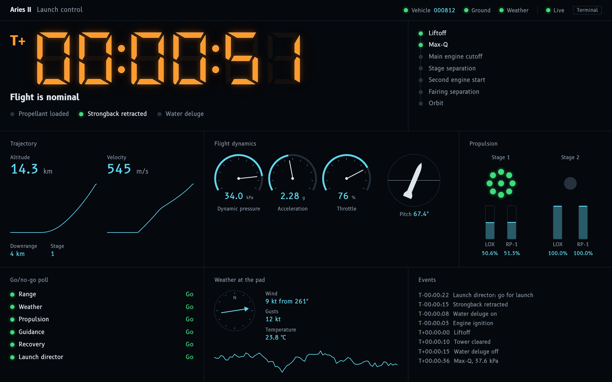
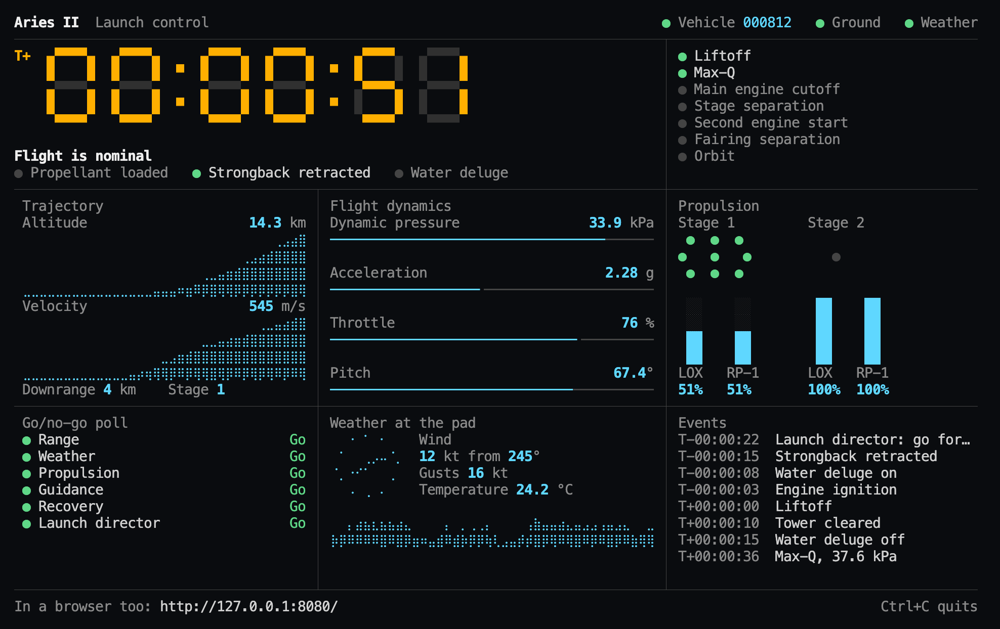
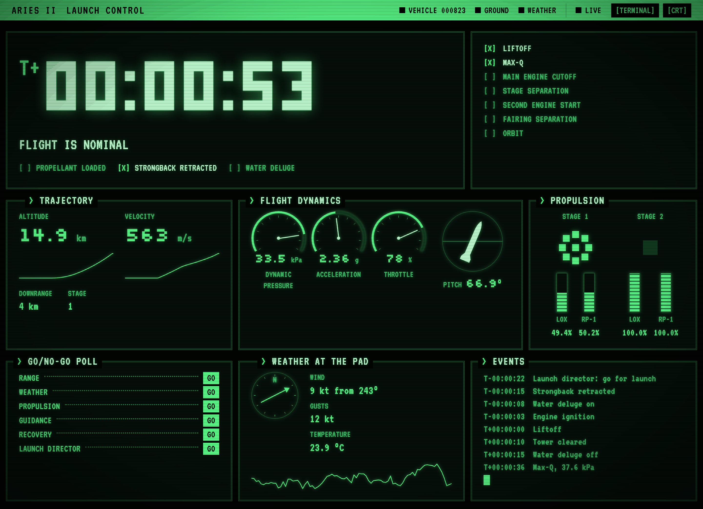

# Sightglass

Live dashboards for a running program, a microcontroller, or anything that
can make an HTTP request. Send values by name and they appear in the browser
(or the terminal) as they change: a window onto a running system, like the
sight glass on a tank.



That's the launch control demo; run it with one command:

```bash
uvx --from "sightglass[web] @ git+https://github.com/davidson-engineering/sightglass" sightglass --demo launch --open
```

It's a plain HTML page fed live by three separate programs: an in-process
source, another process using `Client`, and plain HTTP posts. Its gauges,
tanks and lamps are drawn by CSS from the values; the page has no JavaScript
of its own. The source is in [src/sightglass/launch/](src/sightglass/launch/).

Add `--theme terminal` for a phosphor-terminal look ([themes](#themes)), or
`--terminal` and the same launch is drawn in the terminal as well, laid out by
a screen function of its own ([screen.py](src/sightglass/launch/screen.py)):



- **One line to start.** `start()` serves a dashboard in the background and
  prints its address; `monitor.set("progress", 5)` works from any thread, and
  elements appear the first time you use them.
- **No code needed.** Pipe a program into `sightglass`, `curl` values to it,
  or point it at a serial port, a ZeroMQ socket or a Beckhoff PLC.
- **Any language.** `POST /update` with JSON or `key=value` lines.
- **Keeps up with fast devices.** Serial and ZeroMQ are read on background
  threads and drained completely, so the display never falls behind and a
  stalled device can't freeze it.
- **Honest about staleness.** Pages reconnect by themselves, show how old the
  data is, and dim values while disconnected or (optionally) when a source
  goes quiet; a page fed by several sources can show which one stopped.
- **Plain HTML dashboards.** Mark any element `data-bind="<id>"` and it stays
  live; CSS can turn values into gauges, levels and lamps, like the panel
  above. Otherwise a clean generic page is generated.

## Install

Requires Python 3.11+.

```bash
pip install "sightglass[web]"        # add serial, zmq, ads, or use [all]
```

Until the first PyPI release, install from GitHub:

```bash
pip install "sightglass[web] @ git+https://github.com/davidson-engineering/sightglass"
```

Try it: `sightglass --demo launch --open` runs the page above;
`sightglass --demo --open` shows every kind of display on the generic page.

## Quick start

### From inside a Python program

```python
import time

from sightglass import start

monitor = start()  # prints "Dashboard: http://127.0.0.1:8080/"

for i in range(1, 101):
    time.sleep(0.1)  # your work
    monitor.set("progress", i)
    monitor.set("status", "running" if i < 100 else "done")
```

`set()` returns immediately and is safe from any thread. Each new id becomes
an element (a lamp for `True`/`False`, text otherwise; ids like `"job.rate"`
are grouped under `job`). Long floats are shortened to 6 significant digits.
The dashboard stops when your program exits, or call `monitor.stop()`.

### Without writing code

```bash
# Pipe a program: lines like "progress=5 status=running" or JSON objects
# become values; everything else is printed as usual.
my_program | sightglass

# Push values from anything: shell scripts, cron jobs, other languages.
sightglass &
curl -d 'temperature=21.5 status=ok' http://127.0.0.1:8080/update
curl -d '{"job": {"progress": 5}}' http://127.0.0.1:8080/update
curl http://127.0.0.1:8080/values     # what the dashboard shows, as JSON

# Read a device.
sightglass --serial auto --csv temperature,humidity
sightglass --zmq tcp://localhost:5556
sightglass --ads 5.12.34.56.1.1 --vars 'MAIN.*'    # a Beckhoff PLC
```

`sightglass --help` lists every option, including `--terminal` to draw in the
terminal instead of the browser (its log messages then go to
`sightglass.log`).

### From a separate Python program

The client uses only the standard library, so the program sending values
doesn't need the dashboard's dependencies:

```python
from sightglass import Client

dashboard = Client()  # http://127.0.0.1:8080
dashboard.set("progress", 5)
dashboard.update({"rate": 18.6, "status": "running"})
```

Updates are sent in order in the background. If the dashboard isn't running
yet they're kept and retried, and anything pending is sent when your program
exits, so even a two-line script's values arrive. Pass `token=` if the
dashboard was given one. For one message,
`from sightglass.client import send` and `send({"status": "done"})`.

## Choosing how values look

Declare elements for bars, charts, units and number formats. Anything you
don't declare still appears as text.

```python
from sightglass import Monitor, ProgressBar, Sparkline, TextFormat

monitor = Monitor()
monitor.add(
    ProgressBar("progress", total=500, label="Progress"),
    Sparkline("rate", label="Items/s", format=TextFormat(precision=1)),
)
monitor.start()
```

| Element | Shows | Update with |
| --- | --- | --- |
| `TextElement` | a value, optionally scaled and number-formatted | any value |
| `Sparkline` | a number and a chart of its recent history (`interval=1`: one point a second, for longer spans of fast values) | a number |
| `ProgressBar` | a filling bar from 0 to `total` | a number |
| `RangeBar` | a marker on a min to max track | a number |
| `IndicatorLamp` | on/off | `True`/`False`, `1`/`0`, `on`/`off` |
| `MachineState` | named on/off states packed into one integer | an integer (bit 0 = first state) |
| `Coordinate` | a multi-axis position | a list, or per axis: `"<id>.x"` |
| `Table` | a grid of cells | per cell: `"<id>.<row>.<column>"` |
| `LogMonitor` | the latest messages | a string |

Multi-part elements take updates to a field, addressed as `"<id>.<field>"`.
`monitor.add_group("X", [...])` adds copies of elements under a heading with
ids `X.<id>`, so one list can serve several axes.

`TextFormat(width, precision, force_sign, padding)` formats numbers:
`TextFormat(width=10, precision=3, force_sign=True, padding="0")` turns `27.31`
into `+00027.310`. `Style(fg, bg, bold, dim)` adds colour in the terminal:
a colour name, or one of xterm's 256 colour numbers (`Style(fg=214)` is amber).

For a fixed, curated dashboard use `Monitor(strict=True)`: unknown ids are
then rejected and logged (once per id) instead of creating elements.
`max_elements` (default 500) stops a noisy link creating elements without end.

## Running

| Call | Runs |
| --- | --- |
| `monitor.start(sources=..., outputs=...)` | in a background thread; returns once the dashboard is up (setup errors such as a busy port are raised here) |
| `monitor.serve(sources=..., outputs=...)` | in the foreground until Ctrl+C, then returns quietly |
| `await monitor.run(sources=..., outputs=...)` | inside your own asyncio program |

`outputs` defaults to a `WebDashboard()` for `start()` and `serve()`. The
monitor can also be used as a context manager: `with monitor.start(): ...`.

## Devices and other sources

```python
from sightglass import CsvDecoder, Monitor, SerialSource

monitor = Monitor()
# The device prints one line per sample: "21.5,48,OK"
device = SerialSource(
    "auto", 115200, decoder=CsvDecoder(["temperature", "humidity", "status"])
)
monitor.serve(sources=[device])
```

| Source | Reads |
| --- | --- |
| `SerialSource(port, baudrate, decoder=...)` | a serial port (`"auto"` picks the first USB device); waits for it and reconnects |
| `ZmqSource(endpoint, pattern="sub")` | ZeroMQ PUB/SUB (a publisher that binds `endpoint`) |
| `ZmqSource(endpoint, pattern="pull")` | ZeroMQ PUSH/PULL: binds `endpoint`; unlike PUB/SUB, nothing sent before the monitor starts is lost |
| `AdsSource(target, variables)` | a Beckhoff TwinCAT PLC over ADS ([below](#beckhoff-twincat-plcs-ads)); can also write to it |
| `StdinSource()` | piped standard input, as `sightglass` does |
| `SimulatedSource(fn, rate)` | `fn(seconds)` called `rate` times a second, for demos and tests |

| Decoder | Wire format |
| --- | --- |
| `KeyValueDecoder()` | `X.velocity 1.5`, or `key=value` pairs: `progress=5 status="two words"` |
| `CsvDecoder(keys)` | `1.5,-2.0,OK`, values in the order of `keys` |
| `JsonDecoder()` | `{"X": {"velocity": 1.5}}` per line; nesting addresses groups and fields |
| `BinaryFrameDecoder(names, scale=1000)` | the binary frame protocol below |

#### Binary frame protocol

For firmware where text is too slow or too large:

```
0xAA | id | type | value | n | param_1 ... param_n | 0xFF
```

- `type 0x01`: `value` is a little-endian int32, divided by `scale` (1000 by default).
- `type 0x02`: `value` is a NUL-terminated UTF-8 string (up to 255 bytes).
- `id` and the params are single bytes, translated through `names`
  (`{1: "X", 10: "velocity"}`). The update key is the id's name followed by the
  params' names, so id `X` with param `velocity` updates `"X.velocity"`.

Corrupt frames are skipped and decoding resumes at the next `0xAA`.

### Beckhoff TwinCAT PLCs (ADS)

Install the `ads` extra (`pip install "sightglass[web,ads]"`), then give
`sightglass` the PLC's AMS net id and the variables to show; `*` matches any
characters:

```bash
sightglass --ads 5.12.34.56.1.1 --vars 'MAIN.*,GVL.fTemperature'
```

All the variables are read in one ADS request every 0.1 s and shown under
their PLC names. Structs and arrays become one value per member
(`MAIN.stAxis.fPosition`, `GVL.aTemps[1]`), BOOLs become lamps, and the
variables are looked up again whenever a new program is downloaded.

For a lasting dashboard, describe the PLC in an interface file, with the
types pasted from the PLC project ([examples/plc.toml](examples/plc.toml) is
a commented one):

```toml
target = "5.12.34.56.1.1:851"
types = """
TYPE ST_Axis :
STRUCT
    fPosition : LREAL;
    bEnabled  : BOOL;
END_STRUCT
END_TYPE
"""

[variables]
"MAIN.stAxis1" = "ST_Axis"           # one value per member
"GVL.fTemperature" = {}              # the PLC says what it is
"MAIN.*" = {}                        # every plain top-level variable in MAIN
"GVL.nSetpoint" = { write = true }   # may be written: see below
```

`sightglass --ads plc.toml` reads it. `types` takes struct, enum and alias
declarations as TwinCAT writes them, comments, initial values and
`{attribute 'pack_mode' := '1'}` included. Structs are laid out in memory as
TwinCAT 3 does, and each variable's size is checked against the PLC's, so a
declaration that doesn't match is reported rather than shown as wrong values.
Declared enums are shown by name. From Python:

```python
from sightglass import AdsSource, Monitor

plc = AdsSource("5.12.34.56.1.1", ["MAIN.*", "GVL.fTemperature"])
# or AdsSource.from_file("plc.toml")
Monitor().serve(sources=[plc])
```

**Writing.** Values sent to a variable marked `write = true` (with curl,
`Client` or `monitor.set`) are written to the PLC, and the dashboard shows
what the PLC reads back. Nothing is written unless all of these hold:

- the variable is marked `write = true`;
- `sightglass` was started with `--allow-writes` (`allow_writes=True`);
- the environment variable `SIGHTGLASS_ALLOW_WRITES` is `1`;
- the request has the dashboard's token: values for a PLC are refused over
  HTTP from a dashboard without `--token`.

```bash
export SIGHTGLASS_ALLOW_WRITES=1
sightglass --ads plc.toml --allow-writes --token change-me
curl -H 'Authorization: Bearer change-me' -d 'GVL.nSetpoint=75' http://127.0.0.1:8080/update
```

Each value is checked against its type, then against the type the PLC itself
gives the variable, and a request is all or nothing. A write that is refused
gets 403 (not allowed), 400 (doesn't fit) or 409 (the PLC refused it or isn't
connected), and is never retried, so a setpoint can't arrive late.

**Connecting.** On Linux and macOS, pyads talks to the PLC directly, and the
PLC needs a static route back to this machine: its IP address, and an AMS net
id of that address followed by `.1.1` (sightglass prints both if the PLC
doesn't answer). Add it in TwinCAT, or with pyads' `add_route_to_plc`. On
Windows, pyads goes through TwinCAT's own ADS router: install TwinCAT (XAE,
XAR or the TC1000 ADS setup) and add the route there.

## Outputs

**`WebDashboard(page=None, static_dir=None, host="127.0.0.1", port=8080, title="Monitor", theme="classic", token=None, stale_after=None)`**
serves `page` (or the generic page), streams values over a WebSocket, accepts
`POST /update` and returns the current values as JSON from `GET /values`. `stale_after=2` dims values when no data has arrived
for 2 seconds, for sources that should update continuously. `theme` sets the
pages' look until a viewer switches ([themes](#themes)). Your own page
loads `/_sightglass/sightglass.js` and marks up elements:

```html
<link rel="stylesheet" href="/_sightglass/panel.css">

<span data-bind="temperature"></span>                                  <!-- text -->
<div class="led" data-bind="machine.estop" data-mode="state"></div>    <!-- data-state="on"/"off" -->
<div class="bar" data-bind="X.velocity.ratio" data-mode="width"></div> <!-- width: 0-100% -->
<div data-bind="rate.values" data-mode="sparkline"></div>              <!-- line chart -->
<div class="dial" data-bind="pressure.ratio" data-mode="var"></div>    <!-- CSS variable --value -->
<span data-bind="wind" data-stale-after="3"></span>                    <!-- data-stale="true" once quiet -->

<!-- A segment display: data-ghost draws the unlit segments. -->
<div class="lcd">
  <span class="lcd-field" data-ghost="~~~~~~.~~~"><span data-bind="position_x"></span></span>
</div>

<script src="/_sightglass/sightglass.js"></script>
```

`data-mode="var"` sets the CSS variable `--value` to the number, so CSS alone
can draw a needle (`rotate: calc(var(--value) * 270deg)`) or a fill level
(`height: calc(var(--value) * 100%)`). `data-stale-after="<seconds>"` marks an
element `data-stale="true"` while its value hasn't arrived for that long, so a
page fed by several sources can show which one has gone quiet
(`stale_after` does this for the page as a whole).

Object values are flattened, so a `RangeBar` binds as `<id>.text` and
`<id>.ratio`, a `Sparkline` as `<id>.text` and `<id>.values`, and a
`MachineState` as `<id>.<state>`. `panel.css` provides the segment display
(`.lcd`, `.lcd-field`) and LED (`.led`, `.led-red`, `.led-amber`) styles.
Files in `static_dir` are served under `/static/`.

#### Themes

The generic page and the launch demo come in two themes: **classic**, and
**terminal**, a phosphor-green terminal with optional CRT effects (scanlines,
glow and a power-on flicker, left out for anyone whose system asks for reduced
motion).



`--theme terminal` or `WebDashboard(theme="terminal")` sets the default; a
switch on the page lets each viewer change it, and their browser remembers.
Your own page can offer both:

```html
<head>
  <script src="/_sightglass/theme.js"></script>          <!-- html[data-theme], html[data-crt] -->
  <link rel="stylesheet" href="/_sightglass/terminal.css"> <!-- fonts, --crt-* colours, CRT effects -->
</head>

<button data-theme-switch>Terminal</button>  <!-- aria-pressed while the terminal theme is on -->
<button data-crt-switch>CRT</button>
```

then style it under `html[data-theme="terminal"]` with the `--crt-*` colours
(`--crt-fg`, `--crt-dim`, `--crt-bright`, `--crt-amber`, ...) and fonts:
`--crt-font` (VT323) for text, and two pixel fonts for numbers,
`--crt-display-font` (Micro 5) for a big display like a clock and
`--crt-readout-font` (Silkscreen) for readings. Pixel fonts are sharp only at
whole pixels: give Micro 5 multiples of 11px and Silkscreen multiples of 8px.
`theme.js` sets the theme before anything is drawn, so the page never flashes
the other one.

**`TerminalDisplay(width=60, fps=30, screen=None)`** draws a full-screen view
in the terminal's alternate screen. Log to a file while it runs; anything
printed to the terminal gets drawn over. By default it lists every element;
for a layout of your own, the terminal's counterpart of a custom page, pass
`screen`: a function of `(monitor, width, height)` that returns the whole
frame for a terminal that size, reading values from the elements
(`monitor["rate"].text`) and colouring them with `Style`. A screen is redrawn
at least once a second, so it can show how old values are
(`monitor.ages()`). The launch demo's `screen.py` is a full example.

### Network access and security

The dashboard listens on `127.0.0.1` by default, so only the same machine can
see it. With `host="0.0.0.0"` (or `--host 0.0.0.0`) anyone who can reach the
port can view the values and, unless you set `token`, post updates. Viewing
has no authentication and traffic is not encrypted: on untrusted networks,
reach the dashboard through an SSH tunnel or a reverse proxy with TLS and
authentication.

Values for a device (a PLC variable marked `write = true`) are only accepted
from programs that send the token. The token crosses the network as plain
text unless the dashboard is behind TLS, so a dashboard that can write to a
PLC from other machines needs the tunnel or proxy too.

## Examples

[examples/](examples/README.md) is a gallery where each example shows one way
to feed a dashboard and runs with a single command, with nothing to clone or
install beyond [uv](https://docs.astral.sh/uv/):

| Example | Shows | |
| --- | --- | --- |
| Demo | every kind of display | `uvx --from "sightglass[web] @ git+https://github.com/davidson-engineering/sightglass" sightglass --demo --open` |
| Launch control | the page above: a custom panel fed by three programs | [run](examples/README.md#the-showcase-launch-control) |
| 1. Hello | a Python program with `start()` and `set()` | [run](examples/README.md#1-hello-dashboard) |
| 2. System monitor | this computer, live: charts, bars, a table | [run](examples/README.md#2-system-monitor) |
| 3. From the shell | any language, over HTTP with curl | [run](examples/README.md#3-from-the-shell) |
| 4. Pipe | a program's printed output | [run](examples/README.md#4-pipe-a-programs-output) |
| 5. Many processes | several programs, one dashboard, with `Client` | [run](examples/README.md#5-many-processes-one-dashboard) |
| 6. Docker | deployed as a service, fed over the network | [run](examples/README.md#6-deploy-with-docker) |
| 7. Terminal | drawn in the terminal | [run](examples/README.md#7-in-the-terminal) |
| 8. Custom panel | a segment-display panel, over serial | [run](examples/README.md#8-a-custom-panel-and-a-serial-device) |
| 9. Beckhoff PLC | a TwinCAT PLC over ADS, from an interface file | [run](examples/README.md#9-a-beckhoff-plc-over-ads) |

## Extending

- **Element:** subclass `Element` and implement `update(value)`,
  `to_json()` (what the browser receives) and `render(width)` (terminal text).
  Override `update_field` to accept `"<id>.<field>"` updates.
- **Wire format:** subclass `LineDecoder` and implement
  `decode_line(line) -> {id: value}`, raising `DecodeError` for bad input; or
  subclass `Decoder` for binary formats.
- **Source:** any object with an async generator method `updates()` that
  yields lists of `{id: value}` mappings. A source that can also write to its
  device adds `claims(id)` (true for its ids) and `async def write(update)`,
  raising `WriteError`; values sent to its ids then go to `write()` (see
  `Source` in `monitor.py`).
- **Output:** any object with `async def run(monitor)`, and optionally
  `async def start(monitor)` for setup that can fail and
  `async def flush(monitor)` to deliver the last values before
  `Monitor.stop()` shuts down. Use
  `await monitor.wait_for_change(version)` and
  `monitor.changes_since(version)` to react to new data, and
  `monitor.ages()` for how long ago each element was updated.

## For AI coding agents

`sightglass --guide` prints a concise, recipe-first guide to building and
deploying monitors, written for coding agents (it is also imported by this
repository's `CLAUDE.md`). To make it discoverable in another project, add a
line like this to that project's `CLAUDE.md` or `AGENTS.md`:

```markdown
- Live dashboards for this project: `sightglass`; run `sightglass --guide` before building one.
```

See [CONTRIBUTING.md](CONTRIBUTING.md) for development and releases.

## License

MIT. The bundled DSEG fonts are © keshikan, licensed under the SIL Open Font
License 1.1 (`src/sightglass/web/static/fonts/DSEG-LICENSE.txt`). The launch
control example's B612 fonts are © The B612 Project Authors, under the same
license (`src/sightglass/launch/static/fonts/B612-LICENSE.txt`), as are the
terminal theme's VT323, © The VT323 Project Authors, Micro 5, © The Soft Type
Project Authors, and Silkscreen, © The Silkscreen Project Authors
(`VT323-LICENSE.txt`, `Micro5-LICENSE.txt` and `Silkscreen-LICENSE.txt` in
`src/sightglass/web/static/fonts/`).
